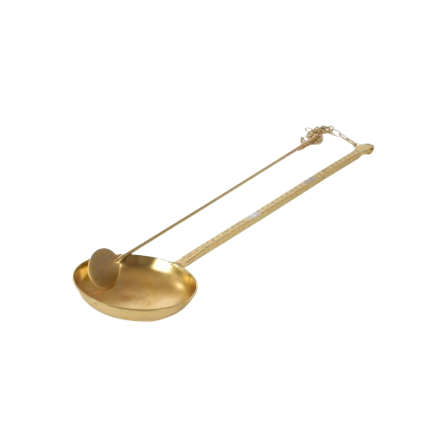
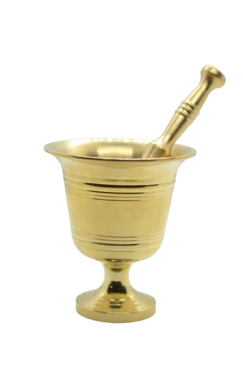



## Introduction

<iframe width="748" height="421" src="https://www.youtube.com/embed/Cs5KzKHFEgU" title="Saudi coffee, culture in a cup" frameborder="0" allow="accelerometer; autoplay; clipboard-write; encrypted-media; gyroscope; picture-in-picture; web-share" referrerpolicy="strict-origin-when-cross-origin" allowfullscreen></iframe>

“Samm.” Said gently.  A Fin’jāl of Saudi coffee is extended to you. The scent rises. Cardamom blends with the fragrance of clove and the sweetness of saffron. It’s warm, like a tender homeland, and a joyful majlis. Like a family reunion on a Friday and the morning of Eid, Saudi coffee smiles at you and gives you tidings of a happy beginning to your day. It is considered one of the most essential national drinks. We all hold unique cultural differences from the West to the East, North, South, and the Najd region, yet we gather around one table to share Saudi coffee. The older adult and the teenager, the joyful and the sorrowful, we are all embraced by it. Today, I will speak about the art of Saudi coffee and how such a simple drink, so beautifully crafted, has captivated everyone with its smoothness and enchanting body. I talk about a part of me as a Saudi, a part of my culture that represents me and tells a meaningful part of my life as I grow up.

## Warmed by Faith, Poured in joy

On many religious occasions, such as Eid al-Fitr, Eid al-Adha, and Ramadan, Saudi coffee has served as a symbol of religious celebration for citizens. Saudi coffee is with you through joy and sorrow, present in gatherings of remembrance (dhikr), Quran memorization circles, funerals, and Islamic festivities. Additionally, the etiquette of serving Saudi coffee reflects Islamic values of hospitality and honoring the guest. Serving it in small, moderate amounts represents temperance and a rejection of extravagance and wastefulness, a form of respect for resources and food, expressing gratitude to God for His blessings. It also plays a central role in wedding hospitality, often served during marriage contract ceremonies as a gesture of generosity. The importance of coffee in Islam has deep historical roots, as it is a beverage that can aid in staying awake for night prayers (qiyam al-layl) and enhance focus during worship, helping the devoted worshiper in their devotion to God.

## Recipe

Each region in Saudi Arabia has a unique way to make coffee. I grew up in Dammam, a beautiful coastal city that holds a deep emotional significance in my heart. That being said,  I chose to share  the Eastern Province region's way of making Saudi Coffee, my favorite.

### Ingredients

* 800 mL Water
* 40 g medium roast ground coffee beans
* 30 g ground cardamom
* A little bit of Saffron
### Instructions
1. Warm water in a pot until it reaches a rolling boil.
2. Add lightly crushed coffee beans and a pinch of saffron.
3. Let it simmer on medium heat for about 17 minutes.
4. Add cardamom and allow it to cook for another 2–3 minutes.
5. Turn off the heat and let the coffee rest for 2 minutes to settle.
6. Samm,  enjoy your Saudi coffee!

## Gear up!

The writer needs his pen, The firefighter needs a hydrant, and a Saudi COffee barista needs her own gear. You ask me, what tools do you need to make Saudi Coffee? I got you! Let's start:

#### 1. Mih’mas (Roster)

A tool made of iron or copper, used to roast coffee over fire. It is equipped with a long handle to stir and turn the coffee beans during roasting.

#### 2. Mubarrad (Cooler)

A container made of wood or copper. You place roasted beans in this box. It comes in different shapes, either circular or rectangular.

#### 3. Najr (Mortar)

A  hollow block made of stone, copper, or iron, used to grind the roasted coffee beans using a pestle called "Yad Al-Najr" (Najr hand). The sound of grinding in the najar is considered a traditional announcement of hospitality, a smooth song that enchants your ears.

#### 4. Dallah (Zall)

It is a traditional thermos that you pour coffee from upon service.

#### 5. Fin’jāl

The small cup that you serve coffee in. Comes in different sizes and colors, usually has a print or a pattern design on it.

#### 6. Sweet or dates

It's always a great idea to serve a sweet treat with the coffee as a form of hospitality.

## One through Five

Each Fin’jāl you drink has a significant meaning, and a deep symbolism. You would be surprised to know how the Fin’jāl between your hands have strong implicit meanings:

#### 1. Al-Heif (Sipping first)

This is the cup the host drinks before serving the guest. It's an old custom used to show the guest that the coffee is safe and not poisoned.

#### 2. Al-Deif (The Guest)

This is the first cup served to the guest, considered a duty of hospitality. The guest is expected to drink it unless in a state of mourning or fasting, as refusing it is difficult and may be perceived as an insult.

#### 3. Al-Keif (The Pleasure)

This is the second cup served to the guest, not out of obligation but rather to reflect the guest's personal enjoyment and satisfaction with the coffee. It’s the lightest of the cups and a sign of comfort and pleasure.

#### 4. Al-Seif (The Sword)

This third cup served to the guest is a symbol of allegiance and support. Drinking it means the guest stands with the host in good times and bad, and is ready to defend them with the sword if needed.

#### 5. Al-Faris (The Knight)

This cup is requested when someone needs help or support. The host pours it and raises it to the heads of the men present at the majlis. A brave individual then drinks it, symbolizing their acceptance of the request and readiness to take on the responsibility or mission.

## Hospitality in Every Gesture

Now, let's go over hospitality rules. These are basics that you should know when serving your guests Saudi coffee in the traditional authentic way:

* Only the host, their off-spring, or a close relative should serve the coffee to guests. If a younger person is present, the older individual refrains from serving unless no one else is available and it's necessary. This is a symbol of respecting the elderly.

* Deriving from islamic traditions, the person pouring the coffee with the Dallah should hold tit) with their left hand and offer the Fin’jāl with the right hand. This is a very strict tradition that breaking is considered an insult to guest,  

* Before offering the coffee to guests, it is customary to set first Fin’jāl aside. This traditional gesture made sure that the coffee was safe and free of any harmful substances.

* As a demonstration of respect, the server shall remain standing while offering coffee, refraining from sitting down until they make sure that every guest has gotten their coffee.

<iframe width="748" height="421" src="https://www.youtube.com/embed/p6tTziq0RDk" title="القهوة السعودية؛ عادات وسلوم" frameborder="0" allow="accelerometer; autoplay; clipboard-write; encrypted-media; gyroscope; picture-in-picture; web-share" referrerpolicy="strict-origin-when-cross-origin" allowfullscreen></iframe>

## The Year of Saudi Coffee 2022

<iframe width="748" height="421" src="https://www.youtube.com/embed/kEk0LFbufQ8?list=PL6vVkzge4FnqWKeEqth9h7k18cBfxyq_4" title="القهوة السعودية" frameborder="0" allow="accelerometer; autoplay; clipboard-write; encrypted-media; gyroscope; picture-in-picture; web-share" referrerpolicy="strict-origin-when-cross-origin" allowfullscreen></iframe>

The Saudi Arabian Ministry of Culture has declared the year 2022 as the Saudi Coffee year, celebrating the deep meaning coffee holds among Saudi nationals. This initiative was launched as a part of emphasizing the importance the Saudi Coffee holds, weather in heritage, identity, and modern day. It also highlighted the Khawlani Saudi coffee beans as a form of support to local agricultural entities. Over the span of 32 events, the Ministry of Culture spread joy globally, inviting people to drink Saudi coffee and experiencing its mesmerizing smell and taste. Make sure to visit the Saudi MInistry of Culture website to learn more about this event.
## References

1. https://engage.moc.gov.sa/moc/year-of-saudi-coffee
2. https://sabq.org/saudia/095e6kqca2

## Copyrights

<a href="https://www.alsalman.moe/post/thebeautyofsaudicoffe/">One Fin’jāl, Please: The beauty of Saudi Coffee</a> © 2025 by <a href="https://www.alsalman.moe/">Mohammed Mokhtar Alsalman</a> is licensed under <a href="https://creativecommons.org/licenses/by-nc-nd/4.0/">CC BY-NC-ND 4.0</a>